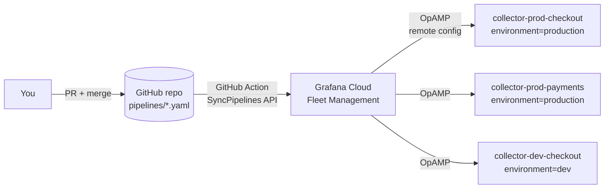

# OTel Collector Fleet Management demo — OpAMP + GitOps

A self-contained demo of managing a fleet of OpenTelemetry Collectors with
[Grafana Fleet Management](https://grafana.com/docs/grafana-cloud/observe-and-act/send-data/fleet-management/),
following the [GitOps workflow](https://grafana.com/docs/grafana-cloud/observe-and-act/send-data/fleet-management/set-up/infrastructure-as-code/gitops/)
from the Grafana Cloud docs:

- **This repo is the source of truth** for collector configuration: every file
  in [`pipelines/`](pipelines/) is a Fleet Management configuration pipeline.
- **A merge to `main` deploys config**: the
  [`grafana/fleet-management-sync-action`](https://github.com/grafana/fleet-management-sync-action)
  workflow syncs `pipelines/` to the Fleet Management API in one atomic call.
- **Collectors pick up changes over OpAMP**: each collector runs under the
  [OpAMP Supervisor](https://opentelemetry.io/docs/collector/management/), which
  registers with Fleet Management, reports health/effective config, and applies
  remote configs live — no image rebuilds, no restarts.



The local fleet is three dockerized collectors with different attributes, so
you can see attribute-based targeting (matchers) in action:

| Collector | environment | team | Gets pipelines |
|---|---|---|---|
| `collector-prod-checkout` | `production` | `checkout` | baseline + production-extras (+ cloud-export) |
| `collector-prod-payments` | `production` | `payments` | baseline + production-extras (+ cloud-export) |
| `collector-dev-checkout` | `dev` | `checkout` | baseline + dev-otlp-debug |

## Prerequisites

- Docker with Compose
- A Grafana Cloud stack (free tier works) with Fleet Management
- Python 3 with PyYAML (only for the optional local sync script)

## 1. Create credentials

In Grafana Cloud, go to **Administration > Users and access > Cloud access
policies** and create two tokens:

1. **Collector token** — access policy with the predefined scope
   `set:otel-data-write` (includes `fleet-management:read`). Used by the
   collectors to register over OpAMP. Goes into `.env`.
2. **CI token** — access policy with `fleet-management:write`. Used by the
   GitHub Action (and/or the local sync script) to write pipelines. Goes into
   GitHub repo secrets, never into `.env` or the repo.

Then grab your connection details from **Connections > Collector > Fleet
Management > API** tab: the **Fleet Management URL** and the **instance ID**
under API Authentication.

## 2. Start the fleet

```sh
cp .env.example .env   # fill in GCLOUD_FM_URL, GCLOUD_FM_INSTANCE_ID, GCLOUD_RW_API_KEY
make up
make logs
```

Within a minute, all three collectors appear in Grafana Cloud under
**Connections > Collector > Fleet Management**, with their `fleet`,
`environment`, and `team` attributes. They're running with an empty config
(`service.AllowNoPipelines`) until pipelines are synced.

## 3. Close the GitOps loop

Push this repo to GitHub (a **private** repo is fine — nothing here needs to be
public) and add three **repository secrets** (Settings > Secrets and variables
> Actions):

| Secret | Value |
|---|---|
| `FM_URL` | Fleet Management URL (same as `GCLOUD_FM_URL`) |
| `FM_INSTANCE_ID` | Fleet Management instance ID |
| `FM_API_TOKEN` | the CI token with `fleet-management:write` |

Merge/push anything touching `pipelines/**` to `main` and the
[sync workflow](.github/workflows/sync-pipelines.yml) uploads all pipelines.
Watch `make logs`: the supervisors receive the new config over OpAMP and
restart the embedded collectors with it within seconds.

> No GitHub handy? `FM_API_TOKEN=<ci-token> make sync` does the same sync from
> your machine via [`scripts/sync-pipelines.py`](scripts/sync-pipelines.py).

## 4. Demo walkthrough

Things to show, roughly in order of wow:

1. **Attribute-based targeting** — in the Fleet Management UI, open a prod vs
   the dev collector: prod runs `baseline + production-extras`, dev runs
   `baseline + dev-otlp-debug`. Same repo, different configs, selected by
   `matchers` on collector attributes.
2. **Remote config change end-to-end** — edit
   [`pipelines/baseline-hostmetrics.yaml`](pipelines/baseline-hostmetrics.yaml)
   (e.g. `collection_interval: 30s` → `5s`), open a PR, merge. The Action syncs
   it and all three collectors apply it live — visible in `make logs` and in
   each collector's "effective configuration" in the UI.
3. **New capability without touching hosts** — `make traces` sends OTLP traces
   to the dev collector, which prints them in full detail. That OTLP listener
   only exists because `dev-otlp-debug.yaml` was delivered over OpAMP.
4. **Namespace cleanup** — delete a pipeline file, merge, and it's removed from
   Fleet Management too (scoped to the `otelcol-fleet-demo` namespace).
5. **Ship to Grafana Cloud** — set the `GCLOUD_OTLP_*` values in `.env`, flip
   `enabled: true` in [`pipelines/cloud-export.yaml`](pipelines/cloud-export.yaml),
   merge, and prod collectors start exporting host metrics to your stack.
   Secrets stay on the collectors as env vars (`${env:...}`) — never in git or
   in Fleet Management.
6. **Break-glass with gcx** — inspect live fleet state and deploy a temporary
   canary pipeline from the CLI, no PR cycle: see
   [docs/gcx-workflow.md](docs/gcx-workflow.md).

## Repo layout

```
├── collector/                  # one image = otelcol-contrib + OpAMP supervisor
│   ├── Dockerfile
│   ├── supervisor.yaml         # OpAMP connection, capabilities, attributes
│   └── entrypoint.sh           # builds basic-auth header, execs supervisor
├── pipelines/                  # source of truth for fleet configuration
│   ├── baseline-hostmetrics.yaml   # matchers: fleet="otelcol-fleet-demo"
│   ├── production-extras.yaml      # matchers: environment="production"
│   ├── dev-otlp-debug.yaml         # matchers: environment="dev"
│   └── cloud-export.yaml           # disabled by default; OTLP → Grafana Cloud
├── examples/                   # ad-hoc pipelines for gcx, NOT synced by CI
│   └── canary-checkout-debug.yaml
├── docs/gcx-workflow.md        # inspect + break-glass workflow with the gcx CLI
├── .github/workflows/sync-pipelines.yml   # GitOps sync on push to main
├── scripts/sync-pipelines.py   # same sync, runnable locally
└── docker-compose.yml          # the 3-collector fleet + telemetrygen
```

Notes:

- Fleet Management merges **all pipelines matching a collector** into a single
  collector config, so component names are suffixed (`debug/dev`,
  `hostmetrics/prod`, …) to avoid collisions across files.
- Each collector's identity (`service.instance.id`) is persisted in a Docker
  volume; `make down`/`make up` keeps identities, `make clean` resets them.
- Pipeline file format is the one expected by `fleet-management-sync-action`
  (`config_type: otel` with inline `contents`). Alloy pipelines (paired
  `.yaml` + `.alloy` files) can live in the same directory.

## Cleanup

```sh
make clean
```

Then delete the pipelines from Fleet Management (empty the `pipelines/` dir and
sync, or remove them in the UI) and revoke the two tokens.
